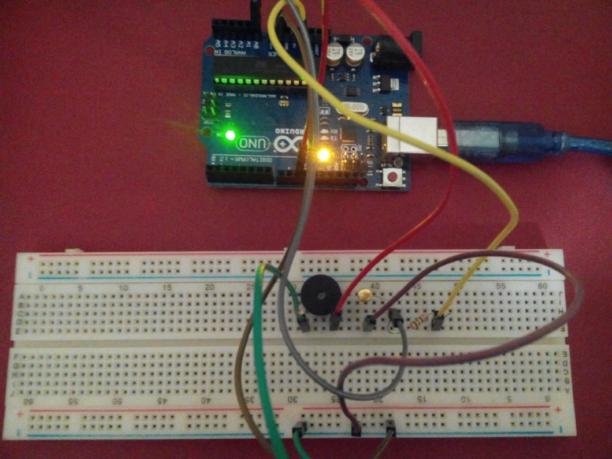
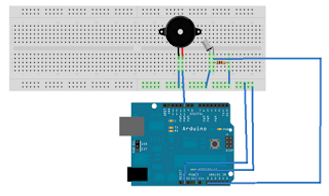
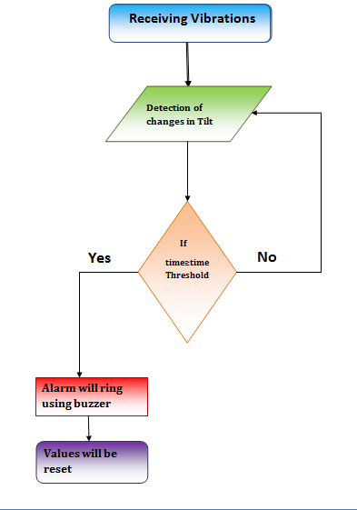
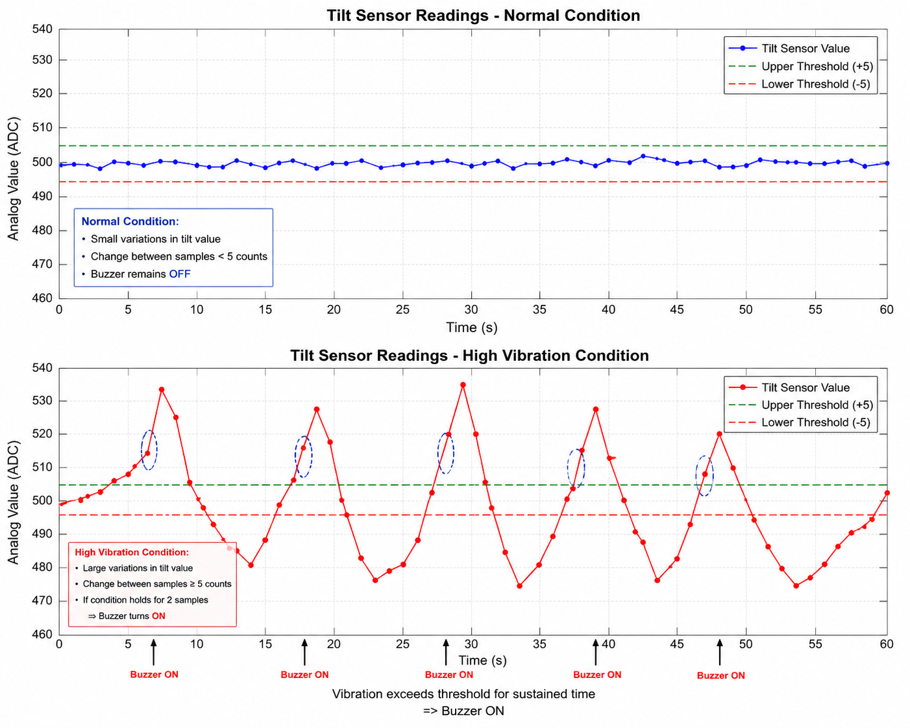

# Earthquake Detector using Arduino

A simple embedded system that detects earthquake-like vibrations using a tilt switch and an Arduino Uno. When continuous vibration exceeding a predefined threshold is detected, the system activates a buzzer to alert nearby users.

> **Note**
>
> This project was developed during my Bachelor's degree as an introductory embedded systems project.

---

## Overview

Earthquakes can cause severe damage with very little warning. The objective of this project is to design a low-cost prototype capable of detecting vibration using a tilt sensor and providing an immediate audible alarm.

The system continuously monitors the output of a tilt switch. If the detected vibration exceeds a predefined threshold for a specified duration, the Arduino activates a buzzer until the vibration stops.

---

## Features

- Arduino Uno based implementation
- Tilt switch vibration sensing
- Real-time monitoring
- Threshold-based detection
- Audible alarm using buzzer
- Low-cost hardware
- Easy to reproduce

---

## Hardware Components

| Component | Quantity |
|-----------|---------:|
| Arduino Uno | 1 |
| Tilt Switch Sensor | 1 |
| Piezo Buzzer | 1 |
| 1 kΩ Resistor | 1 |
| Jumper Wires | 6 |
| Breadboard | 1 |

---
## Hardware Prototype

The prototype was built on a breadboard using an Arduino Uno, a tilt switch, and a piezo buzzer.

<p align="center">
  
</p>

---

## Circuit Diagram

The following circuit shows the connection between the Arduino Uno, tilt sensor, resistor, and buzzer.

<p align="center">
  
</p>

---

## Block Diagram

The overall workflow of the system is illustrated below.

<p align="center">
  
</p>

---
## Working Principle

1. Arduino continuously reads the tilt sensor.
2. The current sensor value is compared with the previous reading.
3. If the difference exceeds a predefined threshold, a vibration counter increases.
4. Once the vibration persists long enough, the buzzer is activated.
5. After the vibration stops, the system resets and continues monitoring.

---

## Algorithm

```
Start

Initialize Arduino
Initialize Tilt Sensor
Initialize Buzzer

Repeat forever

    Read sensor value

    Compare with previous value

    IF vibration > threshold

        Increase timer

        IF timer exceeds limit

            Activate buzzer

        ENDIF

    ELSE

        Reset timer
        Turn buzzer OFF

    ENDIF

Store current value

End Repeat
```
## Applications

- Earthquake warning prototype
- Home safety alarm
- Educational embedded systems project
- Vibration monitoring
- Industrial safety prototype

---

## Future Improvements

- GSM module for SMS alerts
- GPS location reporting
- IoT cloud monitoring
- Automatic gas supply shutoff
- Automatic power cutoff
- Mobile application support

---

## Technologies Used

- Arduino IDE
- Embedded C++
- Arduino Uno
- Analog Sensor Interface

---
## Sensor Reading Visualization

The figure below shows the expected behavior of the tilt sensor in normal and high-vibration conditions.



In normal condition, the sensor value changes only slightly and the buzzer remains OFF.  
During high vibration, the change between consecutive readings exceeds the threshold for a sustained time, so the buzzer turns ON.
## Results

The prototype successfully detected continuous vibration using the tilt sensor. During testing, the buzzer was activated whenever the vibration exceeded the configured threshold and remained active until the movement stopped.

---

## Author

Syeda Tajkia Zareen

Bachelor Project
Department of Electrical and Electronic Engineering
University of Chittagong
